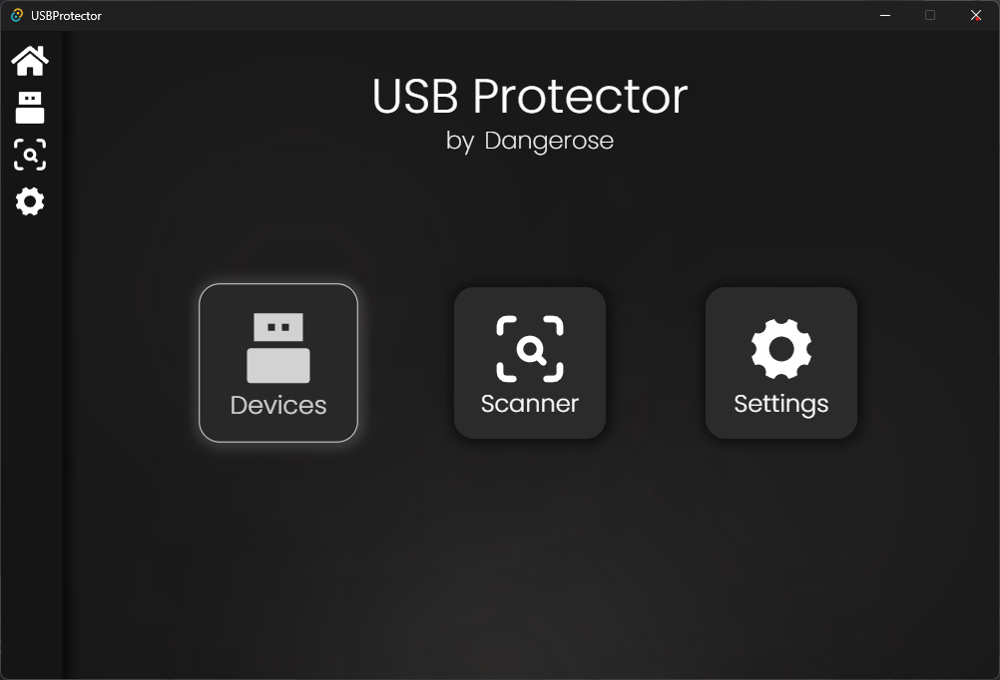
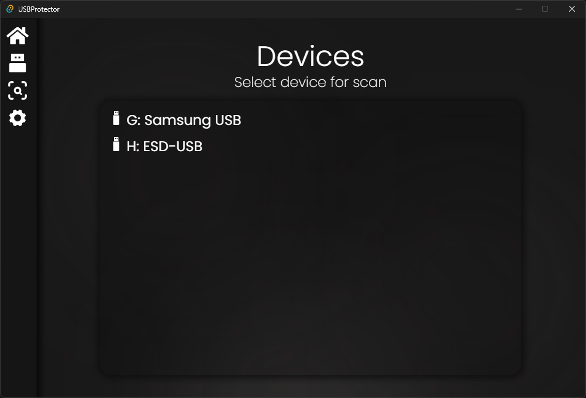
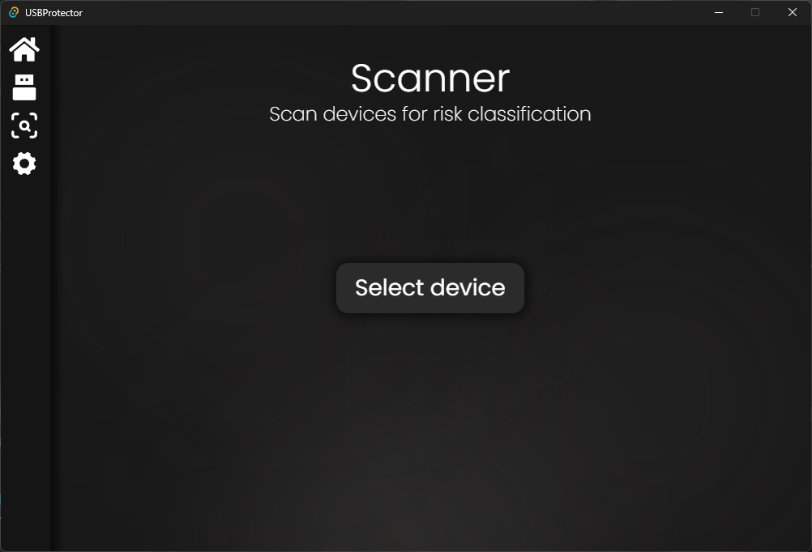
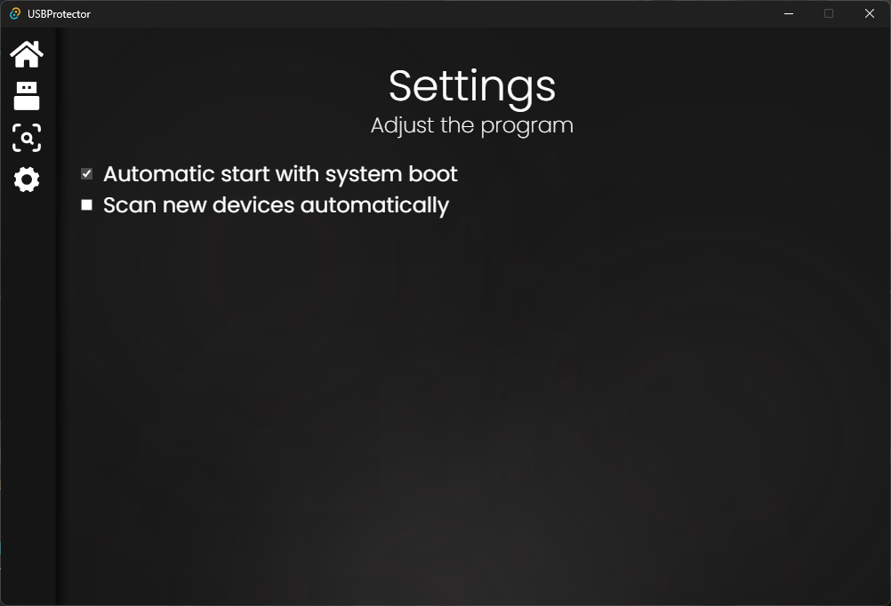

# USBProtector

**Windows desktop tool for monitoring and analyzing USB devices.**

USB Protector detects connected USB devices in real time and classifies the threat. It also presents data in a clear, modern interface.

## ✨ Features

- 🔍 Real-time detection of new USB devices.
- 🎯 Basic risk classification for suspicious devices.

## ⚙️ Tech Stack

     

## 📸 Screenshots

<div style="display: flex; flex-wrap: wrap; justify-content: center; gap: 10px;">
  
  
  
  
</div>

## 🛠️ Installation

```
git clone https://github.com/dangerose777/USBProtector.git
```
```
cd USBProtector
```
```
npm i
```

## 👍 Run

```
npm run tauri dev
```
